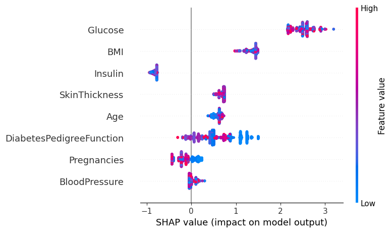
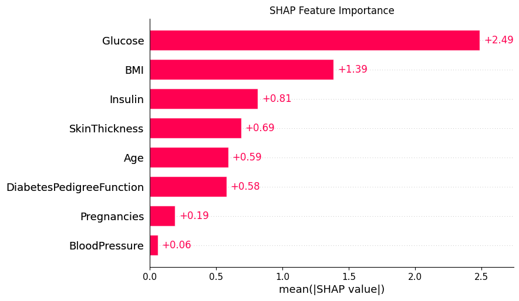

# 🧠 Early Disease Risk Prediction using Machine Learning

This project predicts whether a person is at **risk of developing diabetes** using machine learning techniques. It is developed as part of the AI/ML Developer Task by **Rx.Now**. The system includes model comparison, evaluation, explainability using SHAP, and a deployed Streamlit web interface for real-time predictions.

---

## 📌 Problem Statement

To build a prototype model that can predict the early risk of a medical condition (diabetes) using public datasets. The project should include data preprocessing, model training, evaluation, explainability, and deployment.

---

## 📊 Dataset Used

- **Name**: [PIMA Diabetes Dataset](https://www.kaggle.com/datasets/uciml/pima-indians-diabetes-database)
- **Source**: UCI Machine Learning Repository / Kaggle
- **Shape**: 768 rows × 9 columns
- **Target**: `Outcome` (0 = No Diabetes, 1 = Diabetes)

---

## 📁 Project Structure

early-disease-risk-prediction/
├── app/ # Streamlit app for live predictions
│ └── app.py
├── data/
│ └── diabetes.csv # Cleaned dataset
├── models/
│ ├── rf_model.pkl
│ └── best_model.pkl # XGBoost model
├── notebooks/
│ ├── disease_prediction.ipynb # EDA + Training
│ ├── compare_models.ipynb # Model comparison
│ └── shap_explainability.ipynb # SHAP explainability
├── visuals/
│ ├── eda_plots/
│ │ └── age_distribution.png
│ └── explainability/
│ ├── shap_summary_plot.png
│ └── shap_feature_importance.png
├── requirements.txt
└── README.md

---

## 🔧 Tools & Libraries

- Python, Pandas, NumPy
- Scikit-learn, XGBoost
- SHAP (explainability)
- Streamlit (web app)
- Matplotlib, Seaborn (EDA)

---

## 🚀 Features

- ✅ Data cleaning, preprocessing, and scaling
- ✅ Trained **3 ML models**:
  - Logistic Regression
  - Random Forest
  - XGBoost
- ✅ Evaluated using:
  - Accuracy, Precision, Recall, F1 Score
- ✅ SHAP explainability visualizations
- ✅ Streamlit UI for real-time prediction
- ✅ Clear modular code and folders

---

## ⚖️ Model Comparison Results

| Model               | Accuracy | Precision | Recall | F1 Score |
|---------------------|----------|-----------|--------|----------|
| Logistic Regression | ~0.78    | ~0.72     | ~0.70  | ~0.71    |
| Random Forest       | ~0.81    | ~0.76     | ~0.75  | ~0.75    |
| **XGBoost**         | **~0.83**| **~0.78** | **~0.77** | **~0.77** |

> 🔥 XGBoost was chosen as the best-performing model and deployed.

---

## 📈 SHAP Explainability (Bonus ✅)

SHAP visualizations were added to improve model transparency:

| Plot | Description |
|------|-------------|
|  | Shows feature impact on predictions |
|  | Feature importance ranked by SHAP values |

---

## 🌐 Streamlit App Demo

The app allows users to input patient data and predict diabetes risk instantly.

### 💻 How to Run the App Locally

```bash
git clone https://github.com/YOUR_USERNAME/early-disease-risk-prediction.git
cd early-disease-risk-prediction
pip install -r requirements.txt
streamlit run app/app.py

💡 Creative Additions (Bonus)
✅ SHAP Explainability ✅

✅ Streamlit UI ✅

✅ Model Comparison ✅

❌ Not applicable: Prompt engineering/vector embeddings (no text data used)

👨‍💻 Author
Raj Shukla
Aspiring AI/ML Engineer | Passionate about using tech for healthcare innovation