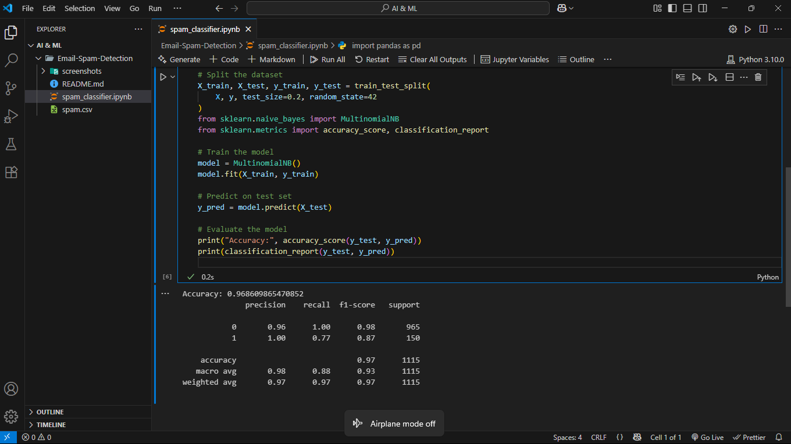
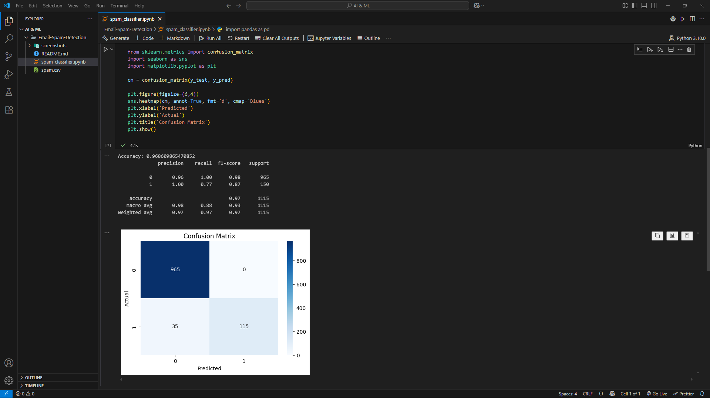

# 📩 Email Spam Detection

## ✅ Objective
Build a machine learning model that classifies messages as spam or ham.

## 💻 Technologies Used
- Python
- Pandas, NumPy
- Scikit-learn
- TF-IDF Vectorizer
- Naive Bayes Classifier

## 🔧 How It Works
1. Load and clean the dataset.
2. Convert text to numbers using TF-IDF.
3. Train a Naive Bayes model.
4. Predict on new data and evaluate performance.

## 📊 Results
- ✅ Accuracy: **96.8%**
- ✅ F1 Score (spam): **0.87**
- ✅ Precision (spam): **1.00**
- ✅ Classification Report:

- ✅ Confusion Matrix:

## 📸 Screenshots Folder
All screenshots from the output can be found in `./screenshots/`