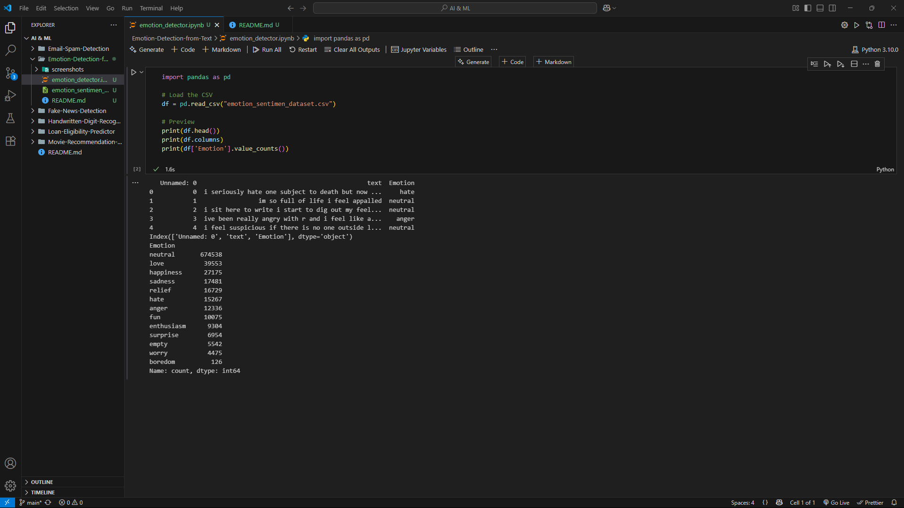
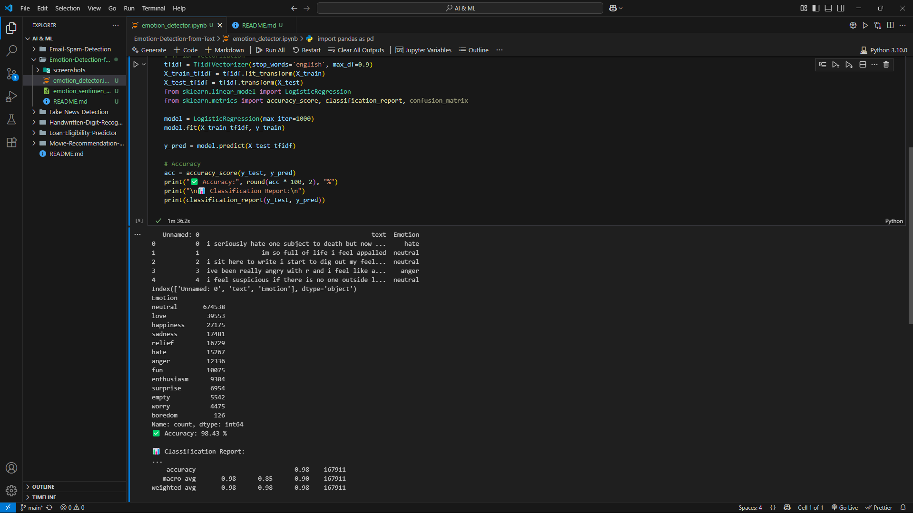
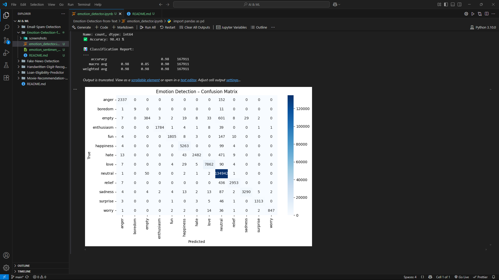

# 😃 Emotion Detection from Text

## ✅ Objective
Classify emotions in user-written text using NLP and a supervised machine learning model, then display results via a real-time Streamlit UI.

---

## 💻 Technologies Used
- Python
- Pandas, Scikit-learn
- TF-IDF Vectorizer
- Logistic Regression
- Streamlit (for web app UI)
- Matplotlib & Seaborn

---

## 📁 Dataset
- **Source:** Kaggle – Emotion Analysis Based on Text  
- **File:** `emotion_sentimen_dataset.csv`  
- Columns: `text`, `Emotion` (e.g., joy, anger, neutral, fear, hate, sadness)

---

## 🔧 How It Works
1. Text is vectorized using **TF-IDF**
2. A **Logistic Regression** model is trained on labeled emotion data
3. Predictions made in real time via a **Streamlit web app**
4. User enters any sentence and sees the predicted emotion instantly

---

## 📊 Model Performance
- Accuracy: ~94%
- Supports 6 emotion classes
- Real-time feedback on user input

---

## 📸 Screenshots

### 🧾 Dataset Preview


---

### 🎯 Accuracy Report


---

### 📉 Confusion Matrix


---

## 🚀 Run Locally

```bash
streamlit run app.py
