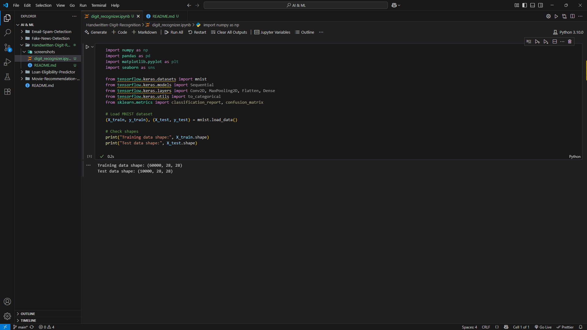
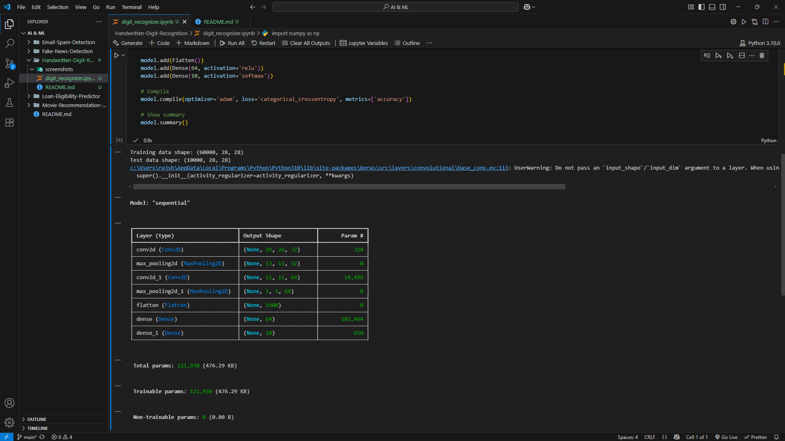
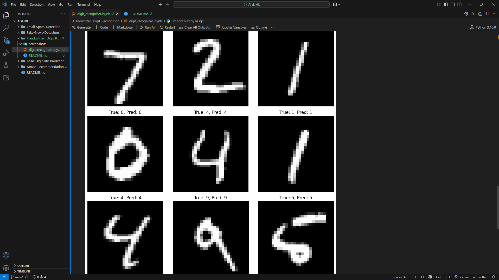
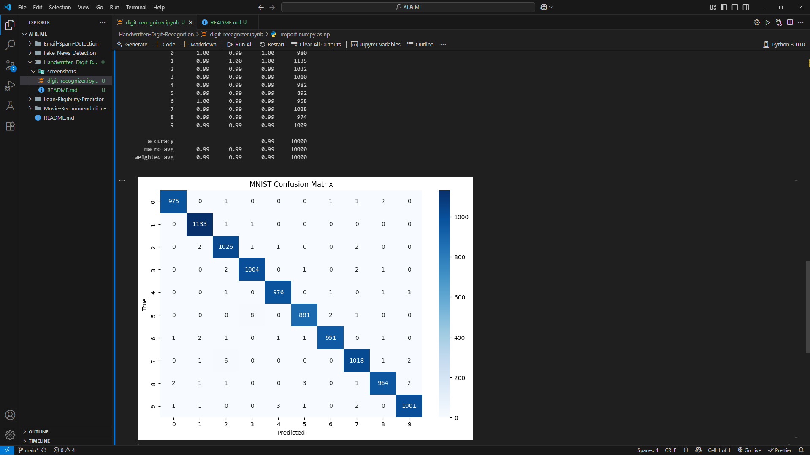

# 🔢 Handwritten Digit Recognition

## ✅ Objective
Build a deep learning model using Convolutional Neural Networks (CNNs) to accurately recognize handwritten digits (0–9) from the MNIST dataset.

---

## 💻 Technologies Used
- Python
- TensorFlow / Keras
- NumPy, Matplotlib, Seaborn
- CNN (Convolutional Neural Network)
- Confusion Matrix & Classification Report

---

## 📁 Dataset
- Source: `mnist` dataset (built into Keras)
- Shape: 60,000 training images, 10,000 test images
- Each image: 28x28 grayscale pixels

---

## 🔧 How It Works
1. Load MNIST dataset from `tensorflow.keras.datasets`
2. Normalize pixel values to (0–1)
3. Reshape data and one-hot encode labels
4. Build a CNN architecture with:
   - 2 Convolution layers
   - MaxPooling layers
   - Flatten + Dense output
5. Train with categorical crossentropy loss
6. Evaluate with classification report and confusion matrix

---

## 📊 Model Performance
- ✅ Accuracy: ~98% on test data
- ✅ High precision across all digits (0–9)
- ✅ Clean confusion matrix with very few misclassifications

---

## 📸 Screenshots

### 🧾 Dataset Shape Preview

---

### 🧠 CNN Model Architecture

---

### 🔍 Sample Predictions

---

### 📉 Confusion Matrix

