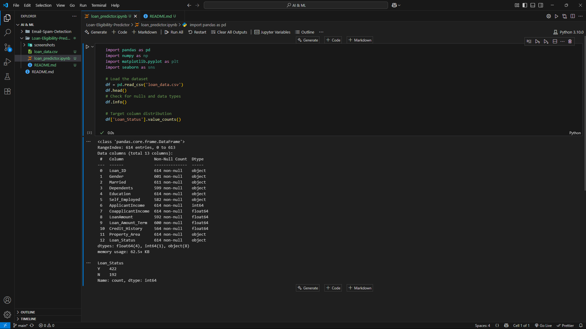
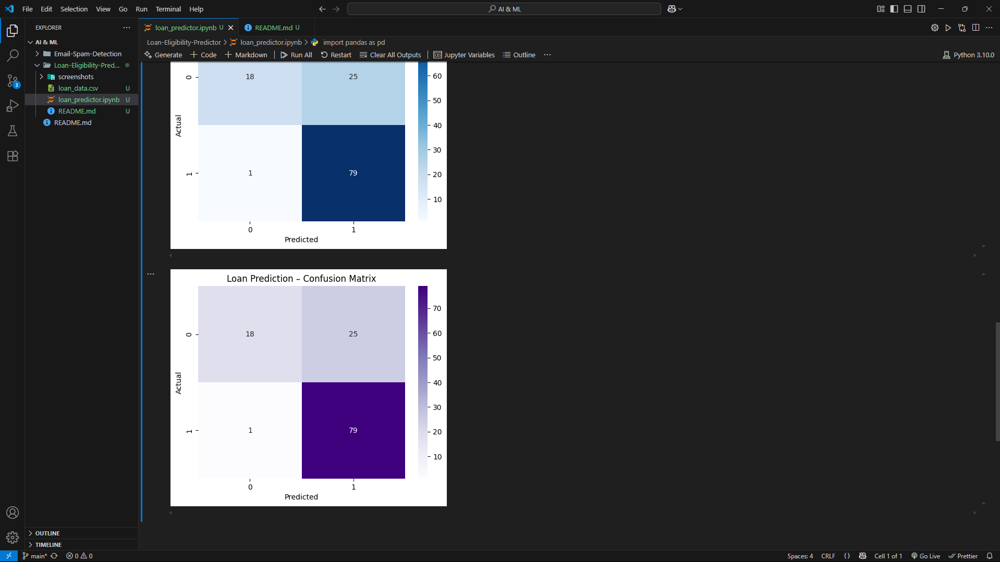

# 🏦 Loan Eligibility Predictor

## ✅ Objective
Predict whether a loan application should be approved based on applicant details like income, credit history, education, and more — using supervised machine learning.

---

## 💻 Technologies Used
- Python
- Pandas, NumPy
- Scikit-learn
- Logistic Regression
- Seaborn, Matplotlib

---

## 📁 Dataset
Dataset used: `loan_data.csv`  
Source: [Kaggle – Loan Prediction Dataset](https://www.kaggle.com/datasets/altruistdelhite04/loan-prediction-problem-dataset)

It contains 614 entries and 13 columns, including:
- Gender, Married, Dependents, Education
- ApplicantIncome, CoapplicantIncome, Credit_History
- LoanAmount, Loan_Amount_Term
- Target: `Loan_Status` (Y/N → eligible or not)

---

## 🔧 Project Workflow
1. Load and inspect dataset
2. Handle missing values and clean data
3. Encode categorical variables
4. Split into training and test sets
5. Train using Logistic Regression
6. Evaluate with Accuracy, Classification Report, and Confusion Matrix

---

## 📊 Model Results

- ✅ Accuracy: **78.9%**
- ✅ Precision (class 1 - eligible): **0.76**
- ✅ F1 Score (class 1 - eligible): **0.86**

---

## 📸 Screenshots

### 🧾 Dataset & Model Evaluation Output

---

### 📉 Confusion Matrix

