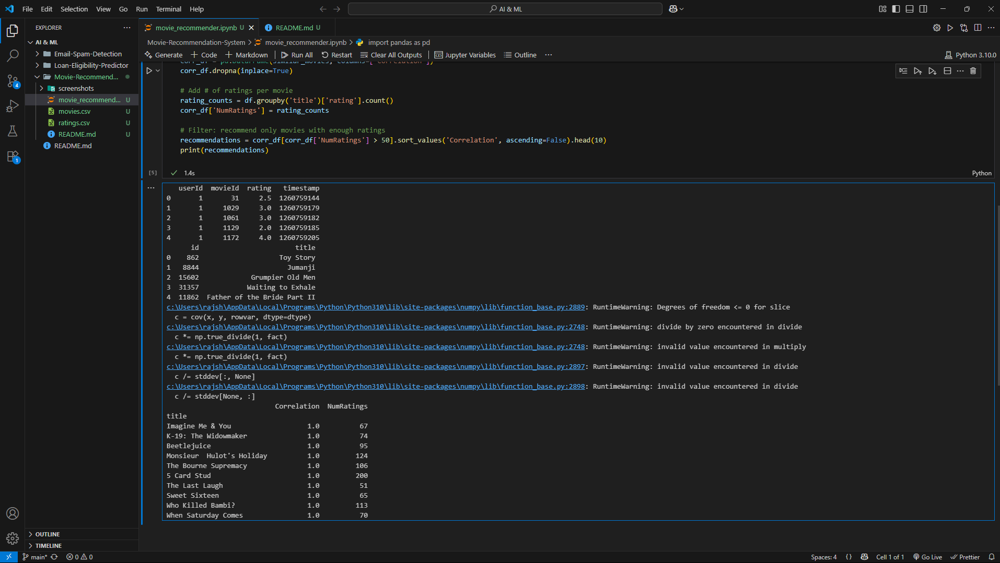

# 🎬 Movie Recommendation System

## ✅ Objective
Build a movie recommendation engine using **user-based collaborative filtering**, which suggests movies based on what similar users have rated highly.

---

## 💻 Technologies Used
- Python
- Pandas, NumPy
- Scikit-learn
- Pearson Correlation
- Jupyter Notebook

---

## 📁 Dataset
From the [MovieLens dataset on Kaggle](https://www.kaggle.com/datasets/rounakbanik/the-movies-dataset)

- `ratings_small.csv`: contains user ratings
- `movies_metadata.csv`: contains movie titles

---

## 🔧 How It Works
1. Merge ratings and movies on `movieId`
2. Create a user-movie rating matrix
3. Select a movie liked by the user
4. Use **Pearson correlation** to find similar movies
5. Recommend top movies with **enough rating support** (e.g., >50 ratings)

---

## 🎯 Sample Output
### 🔹 Correlation-based Recommendations for `'The Dark Knight'`:
| Title                   | Correlation | NumRatings |
|-------------------------|-------------|------------|
| Beetlejuice             | 1.0         | 95         |
| The Bourne Supremacy    | 1.0         | 106        |
| K-19: The Widowmaker    | 1.0         | 74         |
| ...                     | ...         | ...        |

---

## 📸 Screenshots

### 🧾 Merged Dataset Output

---

### 🎯 Movie Recommendations Output

