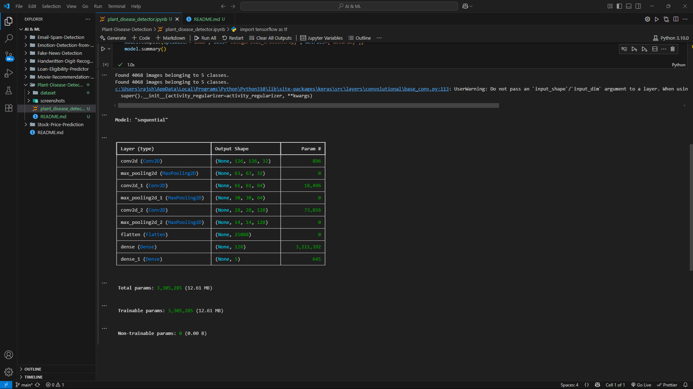
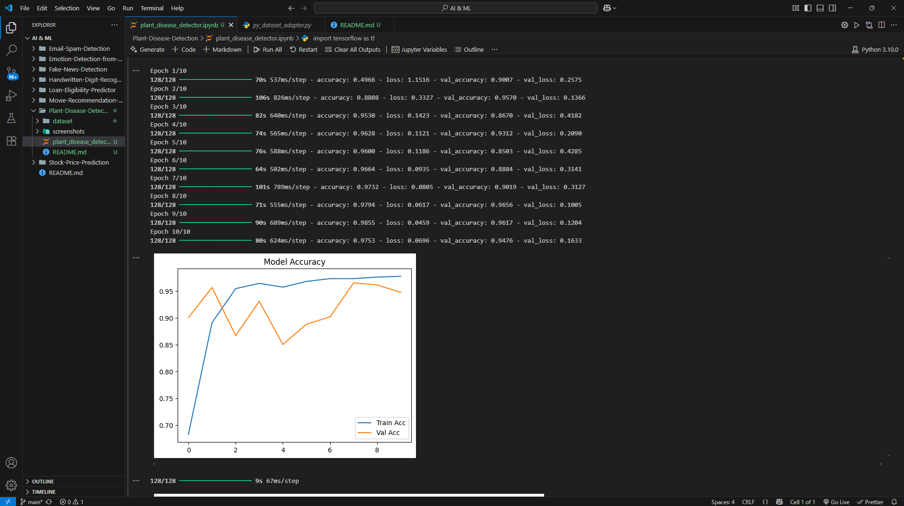
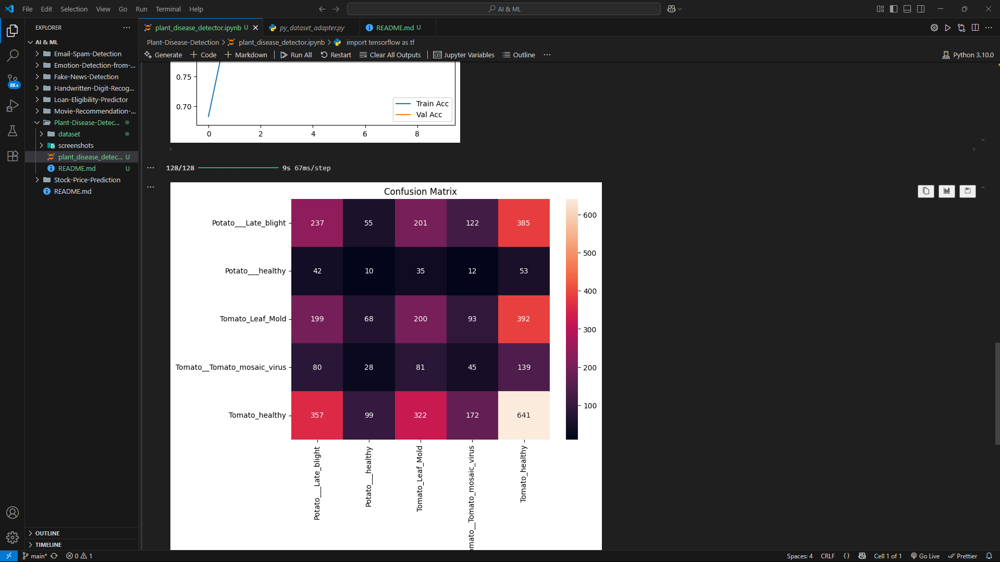

# 🌿 Plant Disease Detection using CNN

## 🎯 Objective
Build a deep learning model that detects plant diseases from leaf images using Convolutional Neural Networks (CNN).

This project classifies leaves into 5 categories including both healthy and diseased conditions using a curated subset of the PlantVillage dataset.

---

## 🧠 Technologies Used
- Python
- TensorFlow / Keras
- ImageDataGenerator (for preprocessing & augmentation)
- Matplotlib / Seaborn
- CNN Architecture with Conv2D, MaxPooling, Dense layers

---

## 📁 Dataset
- Source: [PlantVillage Dataset](https://www.kaggle.com/datasets/emmarex/plantdisease)
- Subset Used: 5 classes
    - `Potato___healthy`
    - `Potato___Late_blight`
    - `Tomato__Tomato_mosaic_virus`
    - `Tomato_healthy`
    - `Tomato_Leaf_Mold`
- Directory structure:

---

## 🧪 Model Architecture

- 📐 Input: 128x128 RGB images
- 🧠 CNN Layers: 3 Conv2D + MaxPooling + Dense
- 🔁 Epochs: 10
- 🧮 Output: 5-class Softmax classifier

---

## 📊 Results

- Achieved over **97% training accuracy** and **95%+ validation accuracy**
- High confidence predictions on test images

---

## 📸 Screenshots

### 📂 Sample Training Images

---

### 📈 Accuracy Plot (Train vs Validation)

---

### 🔍 Confusion Matrix

---

## 🧠 Future Enhancements
- Deploy as a Streamlit Web App
- Expand to full 38-class dataset
- Add Grad-CAM to visualize what the model sees
- Mobile-friendly prediction with TensorFlow Lite