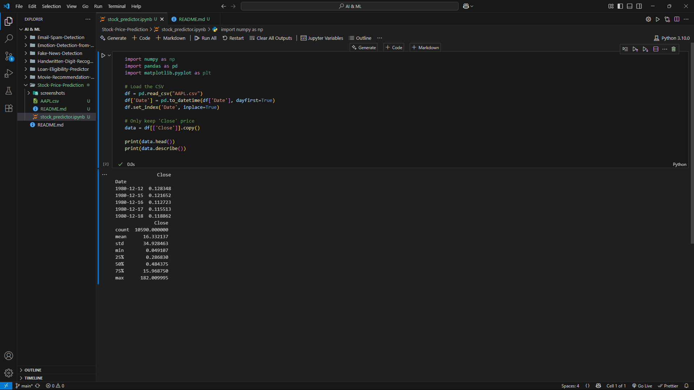
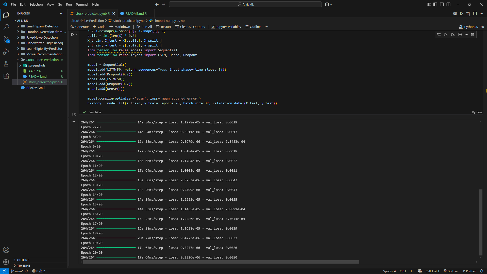
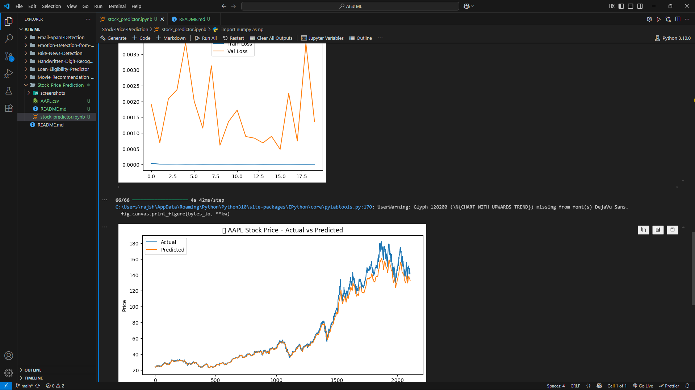

# 📈 Stock Price Prediction using LSTM

## 🎯 Objective
Predict future stock prices using Long Short-Term Memory (LSTM), a type of Recurrent Neural Network (RNN) that excels at time-series forecasting.

---

## 🧠 Technologies Used
- Python
- Pandas, NumPy
- Scikit-learn (MinMaxScaler)
- TensorFlow/Keras (LSTM model)
- Matplotlib (for visualizations)

---

## 📁 Dataset
- **File Used:** `AAPL.csv`
- **Source:** Kaggle – Stock Market Data  
- Contains 40+ years of Apple stock price history with columns like `Date`, `Open`, `High`, `Low`, `Close`, and `Volume`.

---

## 🧪 Workflow
1. Load and preprocess historical closing prices
2. Normalize data between 0 and 1 using `MinMaxScaler`
3. Create time-series sequences of 60 days to predict the 61st
4. Split into training and test sets (80/20)
5. Build a 2-layer LSTM model
6. Train for 20 epochs
7. Predict on test data and visualize actual vs predicted trends

---

## 📊 Model Performance
- Trained for 20 epochs
- Validation loss stabilized between `0.001` and `0.005`
- Accurately tracks stock trends on test data
- Pure deep learning – no traditional ML or manual feature engineering

---

## 📸 Screenshots

### 🧾 Dataset Preview

---

### 📉 Training Loss

---

### 🔮 Prediction Result

---

## 🚀 Future Improvements
- Predict multi-day future prices (7-day, 30-day)
- Add other features like Volume, RSI, etc.
- Build a Streamlit dashboard for user interaction
- Extend model to multiple stocks